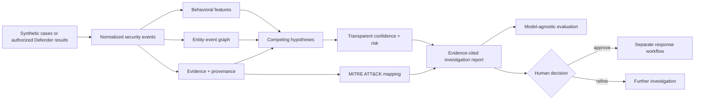
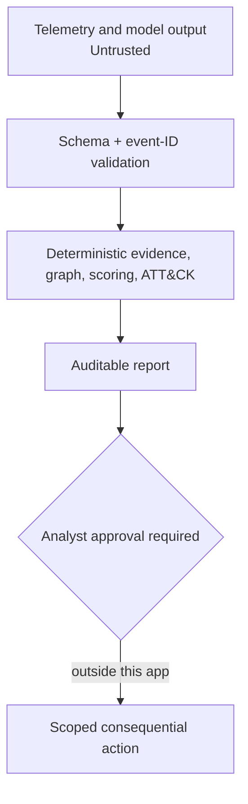
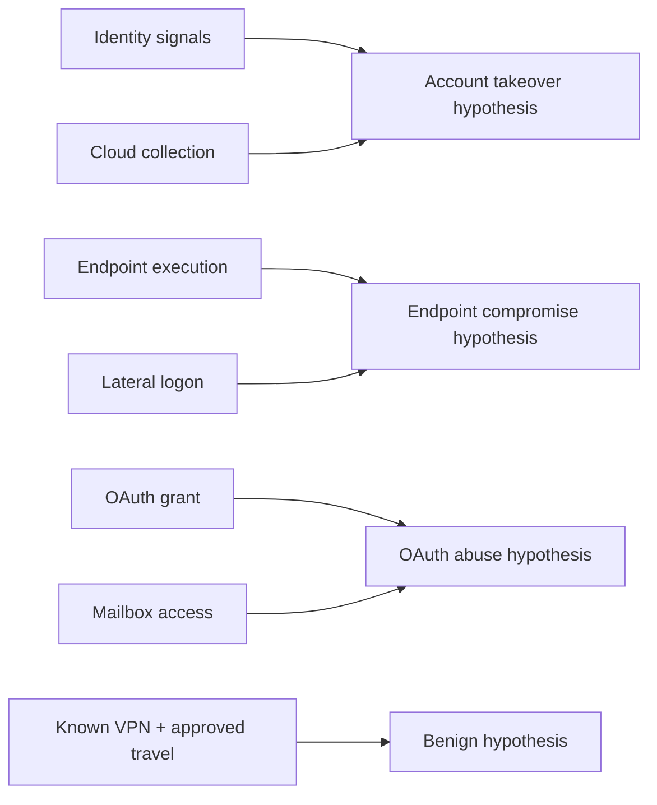

<div align="center">

# Agentic SOC Investigator

### Evidence-grounded investigation across identity, endpoint, cloud, OAuth, and threat intelligence

[](https://www.python.org/)
[](https://fastapi.tiangolo.com/)
[](https://github.com/VinayK88/Agentic-soc-investigator/actions/workflows/tests.yml)
[](docker-compose.yml)
[](LICENSE)
[](#safety-and-responsible-use)

**Hypothesize · collect · correlate · score · explain · evaluate**

[Quick start](#quick-start) · [Architecture](#architecture) · [Research snapshot](#research-snapshot) · [Cases](#reproducible-cases) · [Safety](#safety-and-responsible-use)

</div>

---

An evidence-first applied AI security research platform for investigating identity, endpoint, cloud, and OAuth attacks. It turns normalized telemetry into auditable findings: every verdict links to supporting events, competing hypotheses, an entity-event graph, MITRE ATT&CK techniques, and human-approved response recommendations.

The repository combines a runnable investigation engine, repeatable experiments, defensive KQL, a read-only Microsoft Defender connector, FastAPI endpoints, and a compact analyst workbench.

> **Research boundary:** all checked-in telemetry is synthetic. Offline results are regression-test evidence—not a production effectiveness claim. The platform recommends actions but never executes containment autonomously.

## 60-second reviewer path

Short on time? Review the project in this order:

1. [Understand the SOC investigation problem](#why-this-project).
2. [Inspect the implemented capabilities](#what-is-included).
3. [Follow the evidence and trust architecture](#architecture).
4. [Review the measured research snapshot](#research-snapshot).
5. [Run an investigation locally](#quick-start).

## Why this project?

Traditional alert pipelines often stop at “high severity.” An investigation needs to answer more useful questions:

| Analyst question | What the platform returns |
| --- | --- |
| What could explain this alert? | Competing compromise and benign hypotheses |
| What evidence was collected? | Read-only results with source labels and event IDs |
| What supports or contradicts each theory? | Per-hypothesis evidence, weights, and confidence |
| Which behaviors are represented? | ATT&CK techniques with evidence-grounded rationale |
| Which entities connect the activity? | Entity-event-technique graph summaries |
| What should happen next? | Safe recommendations that require human approval |
| Is the investigator actually grounded? | Shared metrics for verdicts, hypotheses, ATT&CK, citations, and evidence coverage |

## What is included

- Four versioned cases: three multi-stage attacks and one ambiguous benign VPN/travel control.
- Evidence-grounded investigations with transparent risk scoring, citations, hypothesis ranking, and ATT&CK mapping.
- An entity-event-technique graph that exposes relationships hidden across individual alerts.
- Behavioral analytics and bounded anomaly features.
- A shared evaluation contract for verdict accuracy, attack recall, benign specificity, hypothesis accuracy, ATT&CK quality, citation precision, and evidence coverage.
- Evidence-first, alert-only, and permissive-keyword ablations, plus replay support for real-model JSONL outputs.
- Defensive Advanced Hunting queries for identity takeover, endpoint lateral movement, and OAuth consent abuse.
- A least-privileged, read-only Microsoft Graph connector for Defender Advanced Hunting.
- FastAPI endpoints and a browser-based analyst workbench.

## Architecture



### Trust boundaries



An LLM may propose a hypothesis or summarize a case, but event retrieval, citation validation, scoring, ATT&CK mapping, and action authorization remain explicit and testable. See [the architecture and threat model](docs/architecture.md).

## Quick start

The core investigation and evaluation paths use only the Python standard library.

```bash
git clone https://github.com/VinayK88/Agentic-soc-investigator.git
cd Agentic-soc-investigator

python scripts/run_scenarios.py
python scripts/compare_models.py
python -m unittest discover -s tests -v
```

### Run one investigation

```bash
python scripts/run_scenarios.py \
  --scenario identity-takeover-cloud-exfil \
  --json
```

### Run the analyst workbench

```bash
python -m venv .venv
source .venv/bin/activate        # Windows: .venv\Scripts\activate
pip install -r requirements.txt
uvicorn app.main:app --reload
```

Or use Docker Compose:

```bash
docker compose up --build
```

| Destination | URL |
| --- | --- |
| Analyst workbench | <http://127.0.0.1:8000> |
| Interactive OpenAPI docs | <http://127.0.0.1:8000/docs> |
| Health check | <http://127.0.0.1:8000/health> |
| Scenario catalog | <http://127.0.0.1:8000/api/scenarios> |
| Offline model comparison | <http://127.0.0.1:8000/api/evaluation> |

### Call the API

```bash
curl -sS http://127.0.0.1:8000/api/scenarios | python -m json.tool

curl -sS -X POST \
  http://127.0.0.1:8000/api/investigate/identity-takeover-cloud-exfil \
  | python -m json.tool
```

## Research snapshot

The checked-in offline comparison runs all systems against the same four fixtures and scoring contract:

| System | Verdict accuracy | Attack recall | Benign specificity | Hypothesis accuracy | Technique precision | Technique recall | Citation precision | Evidence coverage |
| --- | ---: | ---: | ---: | ---: | ---: | ---: | ---: | ---: |
| Evidence-first v0.2 | 100% | 100% | 100% | 100% | 100% | 100% | 100% | 100% |
| Alert-only ablation | 75% | 100% | 0% | 50% | 60% | 27% | 0% | 0% |
| Permissive keyword baseline | 75% | 100% | 0% | 25% | 38% | 27% | 0% | 0% |

Attack recall alone makes both text-only baselines look acceptable. Benign specificity, hypothesis quality, ATT&CK quality, and evidence coverage expose the operational weakness of escalating everything without supporting telemetry.

Read the [offline research report](docs/research-report.md) before interpreting these numbers. The sample size is four, the cases are synthetic, the rules and labels were developed together, and the thresholds are uncalibrated.

## Reproducible cases

| Case | Key evidence | Expected result |
| --- | --- | --- |
| Identity takeover and cloud collection | Unfamiliar sign-in, MFA change, high-volume download | Confirmed compromise; T1078, T1098, T1530 |
| Endpoint lateral movement | Encoded PowerShell, credential access, remote service logon | Confirmed compromise; T1059.001, T1003.001, T1021.002, T1071.001 |
| OAuth application abuse | Risky consent, mailbox access, cloud-file collection | Confirmed compromise; T1098.003, T1078.004, T1114.002, T1530 |
| Authorized VPN and travel | Known egress, approved travel, compliant device, normal usage | Benign; no ATT&CK mapping |



## How the scoring works

The platform uses an explainable deterministic heuristic—not a claim of calibrated probability.

For each hypothesis:

```text
strength   = sum(evidence weights)
confidence = sigmoid((prior - 0.5) × 2.2 + 1.85 × strength)
confidence = clamp(confidence, 0.01, 0.99)
```

The report-level risk balances the strongest attack hypothesis against the benign explanation:

```text
risk = 100 × strongest_attack_confidence × (1 - 0.62 × benign_confidence)
```

| Risk score | Verdict |
| ---: | --- |
| `70–100` | `confirmed_compromise` |
| `35–69` | `suspicious` |
| `0–34` | `benign` |

Production use requires calibration against labeled investigations, source reliability, base rates, time-separated validation, and analyst feedback.

## Compare actual AI models

Export an identical, versioned prompt bundle for external model runners:

```bash
python scripts/export_model_prompts.py --output /tmp/soc-prompts.jsonl
```

Replay one or more model outputs through the same scoring contract:

```bash
python scripts/compare_models.py \
  --prediction model-a=/path/to/model-a.jsonl \
  --prediction model-b=/path/to/model-b.jsonl
```

Prediction files use one JSON object per scenario:

```json
{"scenario_id":"identity-takeover-cloud-exfil","verdict":"confirmed_compromise","primary_hypothesis":"Account takeover and cloud data theft","technique_ids":["T1078","T1098","T1530"],"evidence_event_ids":["evt-id-001","evt-id-002"]}
```

The repository deliberately makes no claims for models that have not been run. See the [experiment design](docs/experiment-design.md) for repeated stochastic trials and cost, latency, unsupported-citation, refusal, and tool-selection reporting.

## Microsoft Defender integration

The optional connector calls Microsoft Graph's `security/runHuntingQuery` endpoint and requires a runtime token with the least-privileged `ThreatHunting.Read.All` scope. Tokens are neither logged nor persisted.

```python
from app.connectors.defender_graph import DefenderGraphConnector

connector = DefenderGraphConnector.from_environment()
result = connector.run_hunting_query(
    "DeviceProcessEvents | take 10",
    timespan="P7D",
)
```

Set `DEFENDER_GRAPH_ACCESS_TOKEN` only in the runtime environment. Use a test tenant, follow your organization's authorization process, and revalidate KQL schemas before operational use. See the [Defender hunting assumptions](detections/README.md).

## Repository map

```text
app/                  investigation, analytics, graph, API, connector, UI
data/scenarios/       versioned synthetic telemetry and ground truth
detections/kql/       defensive Microsoft Defender hunting queries
docs/                 architecture, experiment design, provenance, report
reports/              reproducible offline metrics snapshot
scripts/              scenario runner, prompt exporter, model comparison
tests/                engine, fixture, KQL, connector, evaluation tests
```

## Safety and responsible use

- Keep collection and hunting read-only unless a human authorizes a separate response workflow.
- Treat telemetry and model output as untrusted input; event text cannot override system or analyst instructions.
- Never commit tenant data, access tokens, secrets, or personal information.
- Require analyst approval for containment, account disablement, token revocation, device isolation, or other consequential action.
- Revalidate query schemas, authorization, retention, and source provenance in the target environment.
- Do not use this project for exploitation, persistence, credential collection, destructive actions, or unauthorized interaction.

See [SECURITY.md](SECURITY.md) for reporting and operational safeguards, and [data provenance](docs/data-provenance.md) for fixture boundaries.

## Documentation

- [Architecture and threat model](docs/architecture.md)
- [Experiment design](docs/experiment-design.md)
- [Model comparison guide](docs/model-comparison.md)
- [Data provenance](docs/data-provenance.md)
- [Offline research report](docs/research-report.md)
- [KQL schema notes](detections/README.md)

Contributions are welcome under [CONTRIBUTING.md](CONTRIBUTING.md). This project is licensed under the [MIT License](LICENSE).
