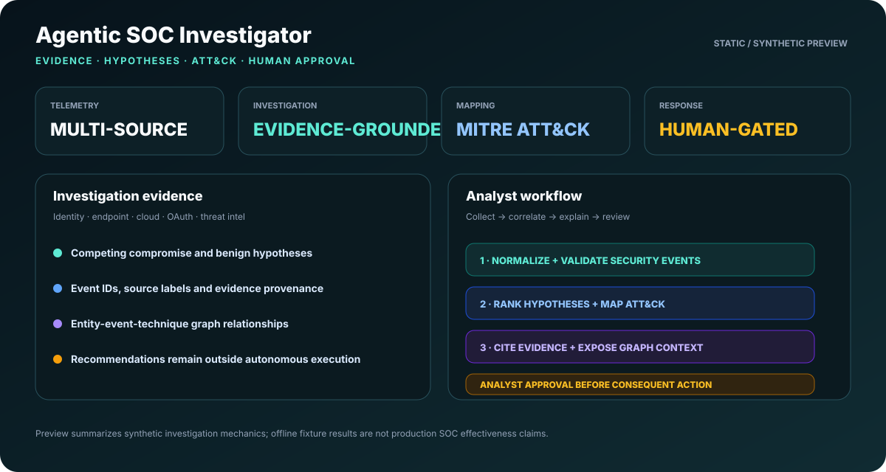
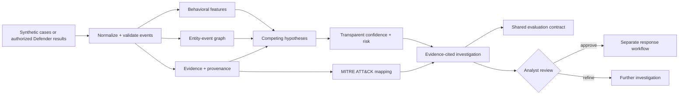
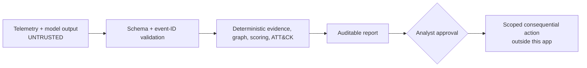

<div align="center">

# Agentic SOC Investigator

### Evidence-grounded SOC investigation with ATT&CK mapping and human-gated response

[](https://www.python.org/)
[](https://fastapi.tiangolo.com/)
[](https://github.com/VinayK88/Agentic-soc-investigator/actions/workflows/tests.yml)
[](docker-compose.yml)
[](LICENSE)
[](#safety-boundary)

**Hypothesize → collect → correlate → score → explain → review**

[Product preview](#product-preview) · [Architecture](#architecture) · [Research snapshot](#research-snapshot) · [Quick start](#quick-start) · [Safety](#safety-boundary)

</div>

---

## Product preview

<p align="center">
  
</p>

<p align="center"><em>Illustrative synthetic product view. The dashboard is presentation-oriented; measured fixture results are reported separately below.</em></p>

Agentic SOC Investigator is a defensive applied-AI security platform for turning fragmented identity, endpoint, cloud, OAuth, and threat-intelligence telemetry into an **auditable investigation**. Every conclusion stays connected to evidence, competing hypotheses, ATT&CK context, graph relationships, and an explicit analyst decision point.

### At a glance

| Area | What the project demonstrates |
| --- | --- |
| Investigation | Competing compromise and benign hypotheses instead of one-shot alert escalation |
| Evidence | Source labels, event IDs, provenance, supporting and contradicting observations |
| Correlation | Entity-event-technique graph across identity, endpoint, cloud, OAuth, and CTI |
| Detection science | Behavioral features, bounded anomaly signals, transparent risk scoring |
| ATT&CK | Evidence-grounded technique mapping with explicit rationale |
| Evaluation | Verdict, hypothesis, ATT&CK, citation, and evidence-coverage metrics |
| Human control | Recommendations are advisory; consequential response remains analyst-gated |

## Why this project

Traditional SOC pipelines often stop at a severity label. An investigation has to answer harder questions: **what happened, what evidence supports it, what could explain it, which entities connect the activity, and what should happen next?**

This project keeps those questions visible rather than hiding them behind a single opaque score.

## Architecture



### Trust boundary



An LLM may summarize or propose hypotheses, but **event retrieval, citation validation, scoring, ATT&CK mapping, and action authorization remain explicit and testable**.

## Core capabilities

- Four versioned synthetic cases: three multi-stage attacks plus one ambiguous benign VPN/travel control.
- Evidence-grounded verdicts with citations, hypothesis ranking, ATT&CK mapping, and transparent risk scoring.
- Entity-event-technique graph correlation across otherwise disconnected alerts.
- Defensive KQL examples for identity takeover, lateral movement, and OAuth abuse.
- Read-only Microsoft Defender Advanced Hunting connector using least-privilege scope.
- Evidence-first, alert-only, and permissive-keyword ablations under the same evaluation contract.
- FastAPI endpoints, analyst workbench, Docker Compose, tests, and CI.

## Research snapshot

The checked-in offline comparison runs all systems against the same four synthetic fixtures and scoring contract.

| System | Verdict accuracy | Attack recall | Benign specificity | Hypothesis accuracy | Technique precision | Technique recall | Citation precision | Evidence coverage |
| --- | ---: | ---: | ---: | ---: | ---: | ---: | ---: | ---: |
| Evidence-first v0.2 | 100% | 100% | 100% | 100% | 100% | 100% | 100% | 100% |
| Alert-only ablation | 75% | 100% | 0% | 50% | 60% | 27% | 0% | 0% |
| Permissive keyword baseline | 75% | 100% | 0% | 25% | 38% | 27% | 0% | 0% |

> These values validate the deterministic research fixture and evaluation mechanics. The sample contains only four synthetic cases; these are **not production SOC effectiveness claims**.

## Reproducible cases

| Case | Key evidence | Expected result |
| --- | --- | --- |
| Identity takeover + cloud collection | Unfamiliar sign-in, MFA change, high-volume download | Confirmed compromise; T1078, T1098, T1530 |
| Endpoint lateral movement | Encoded PowerShell, credential access, remote-service logon | Confirmed compromise; T1059.001, T1003.001, T1021.002, T1071.001 |
| OAuth application abuse | Risky consent, mailbox access, cloud-file collection | Confirmed compromise; T1098.003, T1078.004, T1114.002, T1530 |
| Authorized VPN + travel | Known egress, approved travel, compliant device, normal usage | Benign; no ATT&CK mapping |

## Explainable scoring

Each hypothesis receives a bounded deterministic confidence score:

```text
strength   = sum(evidence weights)
confidence = sigmoid((prior - 0.5) × 2.2 + 1.85 × strength)
confidence = clamp(confidence, 0.01, 0.99)
```

The report-level risk balances the strongest attack hypothesis against the benign explanation:

```text
risk = 100 × strongest_attack_confidence × (1 - 0.62 × benign_confidence)
```

This is an explainable research heuristic, not a calibrated production probability.

## Quick start

The core investigation and evaluation paths use only the Python standard library.

```bash
git clone https://github.com/VinayK88/Agentic-soc-investigator.git
cd Agentic-soc-investigator

python scripts/run_scenarios.py
python scripts/compare_models.py
python -m unittest discover -s tests -v
```

Run one investigation:

```bash
python scripts/run_scenarios.py \
  --scenario identity-takeover-cloud-exfil \
  --json
```

Run the analyst workbench:

```bash
python -m venv .venv
source .venv/bin/activate
pip install -r requirements.txt
uvicorn app.main:app --reload
```

Or:

```bash
docker compose up --build
```

| Destination | URL |
| --- | --- |
| Analyst workbench | `http://127.0.0.1:8000` |
| OpenAPI docs | `http://127.0.0.1:8000/docs` |
| Health | `http://127.0.0.1:8000/health` |
| Scenario catalog | `http://127.0.0.1:8000/api/scenarios` |
| Evaluation | `http://127.0.0.1:8000/api/evaluation` |

## Model comparison

Export the same versioned prompt bundle for external model runners:

```bash
python scripts/export_model_prompts.py --output /tmp/soc-prompts.jsonl
```

Then replay model outputs through the same scoring contract:

```bash
python scripts/compare_models.py \
  --prediction model-a=/path/to/model-a.jsonl \
  --prediction model-b=/path/to/model-b.jsonl
```

The repository deliberately makes no claims for models that have not actually been executed.

## Repository map

```text
app/                  investigation, analytics, graph, API, connector, UI
data/scenarios/       versioned synthetic telemetry and ground truth
detections/kql/       defensive Microsoft Defender hunting queries
docs/                 architecture, experiment design, provenance, report
reports/              reproducible offline metrics snapshot
scripts/              scenario runner, prompt exporter, model comparison
tests/                engine, fixture, KQL, connector, evaluation tests
```

## Safety boundary

- Checked-in telemetry is synthetic.
- Collection and hunting remain read-only by default.
- Telemetry and model output are treated as untrusted input.
- Containment, account disablement, token revocation, device isolation, and other consequential actions require analyst approval outside the investigation engine.
- No exploitation, persistence, credential collection, destructive automation, or unauthorized targeting is implemented.
- Tokens, tenant data, secrets, and personal information must never be committed.

See [SECURITY.md](SECURITY.md), [architecture](docs/architecture.md), [experiment design](docs/experiment-design.md), [data provenance](docs/data-provenance.md), and the [offline research report](docs/research-report.md).

---

<div align="center">

**Evidence first. Hypotheses visible. Humans remain in control.**

</div>
