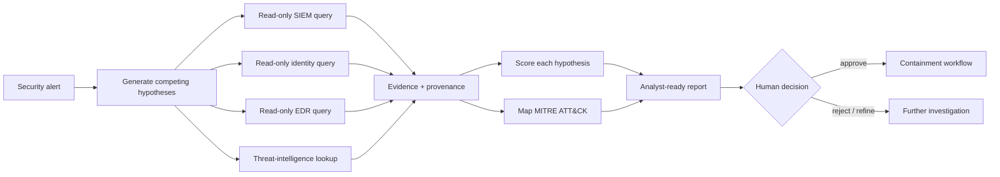
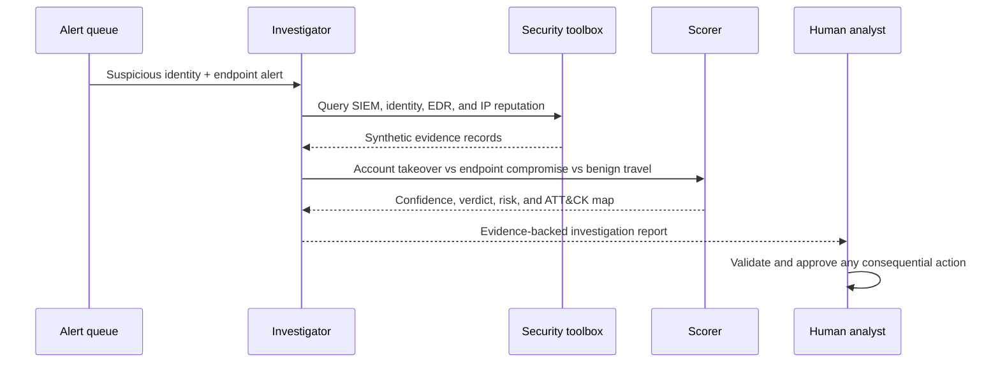
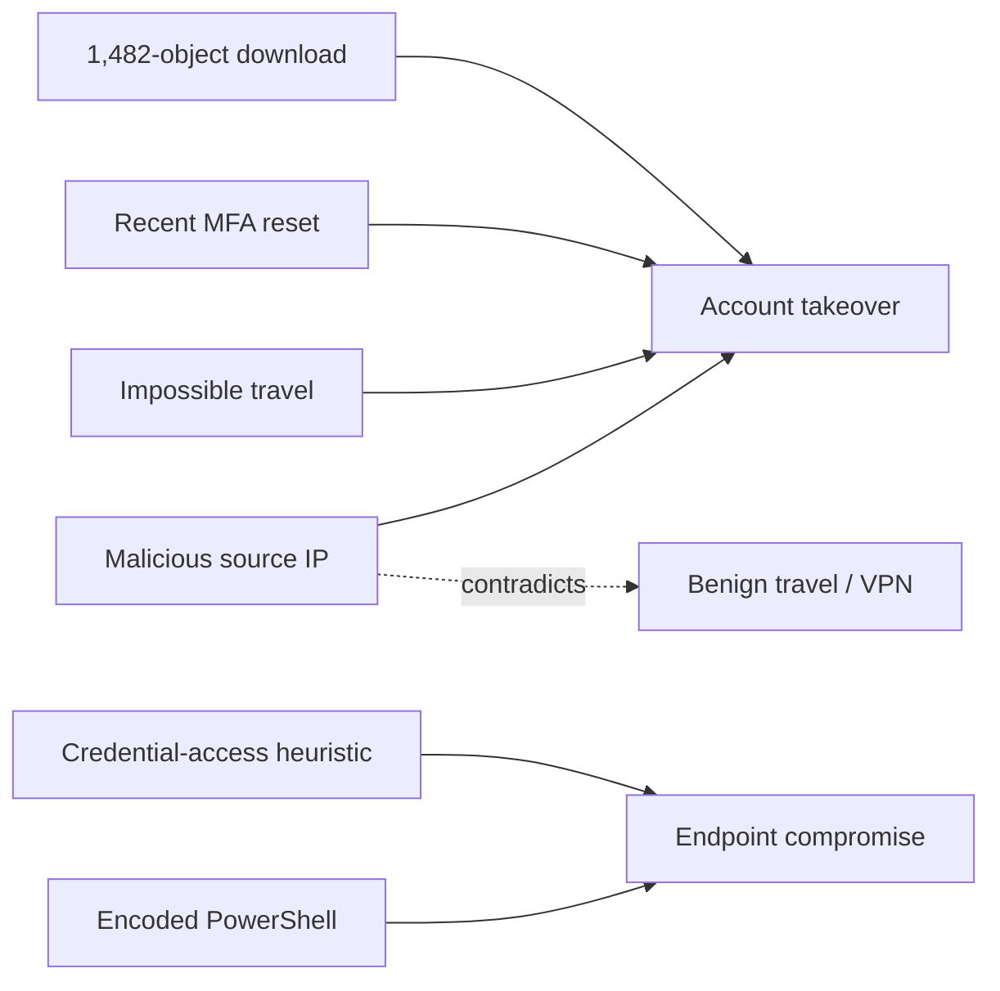
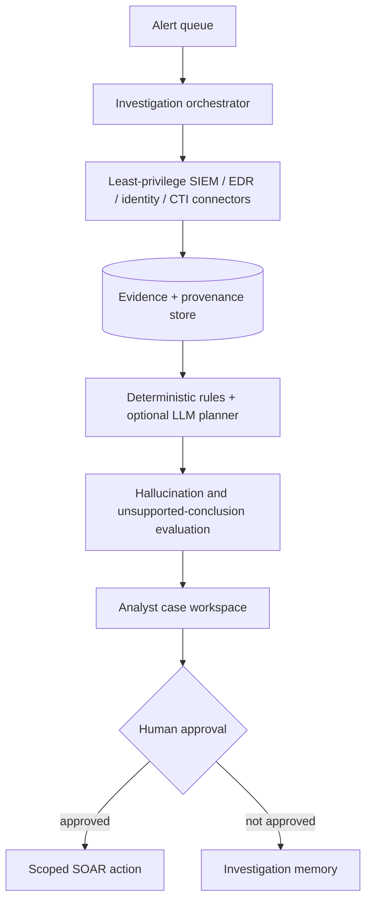

<div align="center">

# Agentic SOC Investigator

### Turn one security alert into hypotheses, evidence, ATT&CK context, and analyst-ready next actions

[](https://www.python.org/)
[](https://fastapi.tiangolo.com/)
[](docker-compose.yml)
[](#run-the-tests)
[](LICENSE)
[](#safety)

**Hypothesize · collect · correlate · score · explain · recommend**

[Quick start](#quick-start) · [Demo investigation](#demo-investigation) · [Architecture](#architecture) · [Scoring](#how-the-scoring-works)

</div>

---

A deterministic, evidence-driven SOC investigation engine. It correlates a synthetic alert across read-only SIEM, identity, EDR, and threat-intelligence tools; tests competing hypotheses; maps the evidence to MITRE ATT&CK; and produces a transparent report for human review.

The default demo runs entirely offline. It needs **no API key, external LLM, SIEM, or production telemetry**.

## Why this project?

Traditional alert pipelines often stop at “high severity.” An investigation needs to answer more useful questions:

| Analyst question | What the engine returns |
| --- | --- |
| What could explain this alert? | Competing compromise and benign hypotheses |
| What evidence was collected? | Read-only tool results with source labels |
| What supports or contradicts each theory? | Per-hypothesis evidence and confidence |
| Which behaviors are represented? | ATT&CK techniques with rationale |
| What should happen next? | Safe remediation recommendations requiring human approval |

## Architecture



### Investigation lifecycle



## Core capabilities

- Typed alert, evidence, hypothesis, ATT&CK, and report contracts
- Read-only synthetic security-tool interfaces
- Three explicit competing hypotheses
- Supporting and contradicting evidence weights
- Deterministic confidence and risk scoring
- ATT&CK mapping for identity, execution, remote access, and cloud collection
- Human-controlled remediation recommendations
- Investigation timeline and analyst summary
- FastAPI, browser demo, Docker Compose, and pytest coverage

## Quick start

### Local Python

```bash
git clone https://github.com/VinayK88/Agentic-soc-investigator.git
cd Agentic-soc-investigator

python -m venv .venv
source .venv/bin/activate        # Windows: .venv\Scripts\activate
pip install -r requirements.txt
uvicorn app.main:app --reload
```

### Docker Compose

```bash
docker compose up --build
```

| Destination | URL |
| --- | --- |
| Browser investigation demo | <http://localhost:8000> |
| Interactive OpenAPI docs | <http://localhost:8000/docs> |
| Health check | <http://localhost:8000/health> |
| Built-in alert fixture | <http://localhost:8000/demo-alert> |

## Demo investigation

### 1. Fetch the built-in alert

```bash
curl -sS http://localhost:8000/demo-alert | python -m json.tool
```

```json
{
  "alert_id": "ALRT-2026-001",
  "title": "Suspicious Entra sign-in followed by cloud download",
  "severity": "high",
  "user": "maya.chen@contoso.example",
  "device": "FIN-LT-044",
  "src_ip": "203.0.113.66",
  "timestamp": "2026-08-09T10:34:00Z",
  "description": "Impossible travel and unusual data access were observed for a finance identity."
}
```

### 2. Investigate it

```bash
curl -sS -X POST http://localhost:8000/investigate \
  -H 'Content-Type: application/json' \
  -d '{
    "alert_id": "ALRT-2026-001",
    "title": "Suspicious Entra sign-in followed by cloud download",
    "severity": "high",
    "user": "maya.chen@contoso.example",
    "device": "FIN-LT-044",
    "src_ip": "203.0.113.66",
    "timestamp": "2026-08-09T10:34:00Z",
    "description": "Impossible travel and unusual data access were observed."
  }' | python -m json.tool
```

### 3. Inspect the deterministic result

The included dataset correlates six security signals:



Abridged output:

```json
{
  "verdict": "confirmed_compromise",
  "risk_score": 93,
  "summary": "Confirmed Compromise with modeled risk 93/100. Highest-confidence hypothesis: Account takeover (99%).",
  "hypotheses": [
    {
      "name": "Account takeover",
      "prior": 0.4,
      "confidence": 0.99,
      "status": "supported"
    },
    {
      "name": "Endpoint compromise",
      "prior": 0.25,
      "confidence": 0.9453,
      "status": "supported"
    },
    {
      "name": "Benign travel / VPN",
      "prior": 0.3,
      "confidence": 0.1256,
      "status": "rejected"
    }
  ],
  "mitre_attack": [
    {"technique_id": "T1078", "name": "Valid Accounts"},
    {"technique_id": "T1133", "name": "External Remote Services"},
    {"technique_id": "T1059.001", "name": "PowerShell"},
    {"technique_id": "T1530", "name": "Data from Cloud Storage"}
  ]
}
```

## How the scoring works

The project uses an explainable deterministic heuristic—not a claim of calibrated probability.

For each hypothesis:

```text
strength   = sum(evidence weights)
confidence = sigmoid((prior - 0.5) × 2.2 + 2 × strength)
confidence = clamp(confidence, 0.01, 0.99)
```

The report-level risk balances the strongest compromise theory against the benign explanation:

```text
risk = 100 × strongest_compromise_confidence × (1 - 0.45 × benign_confidence)
```

| Risk score | Verdict |
| ---: | --- |
| `75–100` | `confirmed_compromise` |
| `40–74` | `suspicious` |
| `0–39` | `benign` |

Production deployments should calibrate weights and thresholds against labeled investigations, source reliability, base rates, and analyst feedback.

## Read-only tool boundary

`SecurityToolbox` exposes four small interfaces:

```python
query_siem(user, src_ip)
query_identity(user)
query_edr(device)
lookup_ip(ip)
```

The bundled implementation reads `data/synthetic_security_data.json`. Real adapters should preserve the same narrow, typed, read-only boundary and apply least privilege, audit logging, tenant isolation, and explicit authorization.

## Recommended actions are not executed

For suspicious or confirmed investigations, the engine recommends actions such as:

- Revoke active sessions and refresh tokens.
- Require phishing-resistant MFA.
- Review OAuth grants, mailbox rules, and cloud-file access.
- Isolate the device only when endpoint evidence corroborates execution.
- Preserve telemetry and obtain human approval before remediation.

The engine does not perform those actions.

## Repository map

```text
.
├── app/
│   ├── main.py          # FastAPI routes
│   ├── models.py        # Alert, evidence, hypothesis, and report schemas
│   ├── engine.py        # Investigation, scoring, ATT&CK, and actions
│   ├── tools.py         # Read-only synthetic security toolbox
│   └── static/index.html
├── data/synthetic_security_data.json
├── tests/test_engine.py
├── Dockerfile
├── docker-compose.yml
├── requirements.txt
├── SECURITY.md
└── CONTRIBUTING.md
```

## Run the tests

```bash
pytest -q
```

The current tests verify high-risk compromise detection, ATT&CK mapping, account-takeover confidence, and required human-approval language.

## Production evolution



Roadmap areas:

- Temporal evidence graphs and investigation memory
- Pluggable tool registry with structured allowlists
- Safe Sentinel, Defender, and Entra-style adapters
- ATT&CK tactic/technique chain visualization
- Typed LLM planning with evidence-grounding evaluations
- Analyst feedback and confidence calibration
- End-to-end provenance, observability, and approval auditing

## Safety

This project contains synthetic telemetry and defensive investigation logic only. It does not perform exploitation, persistence, credential collection, or unauthorized interaction. Never submit production secrets or customer telemetry to the demo API. See [SECURITY.md](SECURITY.md).

## Contributing

Contributions are welcome for defensive detections, synthetic datasets, ATT&CK mappings, explainability, tests, and safe integrations. Read [CONTRIBUTING.md](CONTRIBUTING.md) and run `pytest -q` before opening a pull request.

## License

Distributed under the [MIT License](LICENSE).
